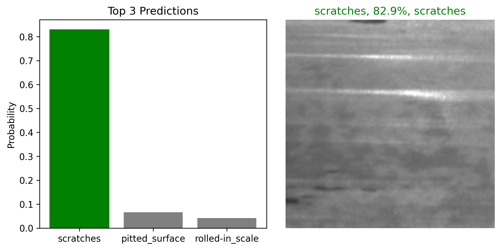

<p align="center">
  
  
  
  
  
</p>

<h1 align="center">🧠 Surface Defect Detection using Transfer Learning (MobileNetV2)</h1>

<p align="center">
  <b>End-to-End Machine Learning & MLOps project integrating TensorFlow, TFLite, FastAPI, Docker, and AWS EC2.</b><br>
  Detects and classifies <b>steel surface defects</b> using a lightweight deep learning model optimized for deployment.<br>
  Deployed on both <a href="http://51.21.196.228:8000/docs" target="_blank">AWS EC2</a> and 
  <a href="https://huggingface.co/spaces/arafatMahmood/Surface_defect_detection" target="_blank">Hugging Face Spaces</a>.
</p>

---

## 📊 Dataset

- **Source:** [NEU Surface Defect Database (Kaggle)](https://www.kaggle.com/datasets/kaustubhdikshit/neu-surface-defect-database)  
- **Classes (6):**
  - Crazing  
  - Inclusion  
  - Patches  
  - Pitted Surface  
  - Rolled-in Scale  
  - Scratches  

Each image shows a unique type of steel surface defect used to train and validate the model.

---

## 🧩 Project Workflow

### 1. Data Preparation & Preprocessing
- Loaded image paths and labels into lists (`defect_images`, `defect_labels`)
- Defined a TensorFlow-based preprocessing pipeline to normalize and resize images
- Created efficient data batches for training, validation, and testing

### 2. Model Architecture
- **Base Model:** MobileNetV2 (pre-trained on ImageNet)
- **Enhancements:**
  - Data Augmentation (flip, rotate, zoom, contrast)
  - Dropout (0.5)
  - L2 regularization (0.04)
  - Label smoothing (0.1)

### 3. Training Configuration
- Optimizer: `Adam (1e-5)`
- Loss: `CategoricalCrossentropy`
- Epochs: `50`
- Batch Size: `32`
- Callbacks: `TensorBoard`, `EarlyStopping (patience=3)`, `ModelCheckpoint`

---

## 📈 Model Performance
- Training Accuracy: 84.7%
- Validation Accuracy: 84.0%
- Test Accuracy: 86.7%
- Precision: 0.8961
- Recall: 0.8667

----

## 📸 Sample Prediction Visualization

#### Top 3 predictions Visualization


----
## ⚙️ Model Optimization (TensorFlow Lite)

To ensure lightweight deployment, the trained TensorFlow model was **converted to TensorFlow Lite (.tflite)** format.  
This reduced the model size drastically while maintaining accuracy, making it ideal for Docker and edge deployment.

```python
converter = tf.lite.TFLiteConverter.from_keras_model(model)
converter.target_spec.supported_ops = [
    tf.lite.OpsSet.TFLITE_BUILTINS,
    tf.lite.OpsSet.SELECT_TF_OPS
]
tflite_model = converter.convert()
```

----

## 🧩 API Deployment (FastAPI + Docker + AWS EC2 + Hugging Face Spaces)

### 1. FastAPI Inference Service 
- /health   →  Service health check  
- /predict  →  Predict surface defect type  

### 2. Dockerization
- Built with **Python 3.10-slim** base image
- Installed only essential dependencies (**tflite-runtime**)
- Final Image size ~ **385 MB**

### 3. Cloud Housing
#### 🌐 **AWS EC2 Deployment**
- **Ubuntu Server** instance  
- Docker installed and image pulled from **Docker Hub**  
- Port **8000** exposed to the internet via security group rules  
- Live API Docs: [FastAPI Endpoint 🔗](http://51.21.196.228:8000/docs)

#### 🤗 **Hugging Face Spaces Deployment**
- Hosted interactive demo using **Sreamlit**  
- Deployed app: [Surface Defect Detection 🔗](https://huggingface.co/spaces/arafatMahmood/Surface_defect_detection)

## 🧰 Tech Stack
-------------------------------------------------
| Stage             | Tools / Libraries                       |
|-------------------|-----------------------------------------|
| Data Processing   | TensorFlow, NumPy                       |
| Model Building    | MobileNetV2, Keras                      |
| Optimization      | TensorFlow Lite                         |
| API Framework     | FastAPI                                 |
| Containerization  | Docker                                  |
| Cloud Deployment  | AWS EC2 (Ubuntu), Hugging Face Spaces   |
| Frontend Demo     | Streamlit                               |

---

## 🧪 API Usage
- Endpoint: POST /predict
- Response:
 {
  "predicted_label": "patches",
  "confidence": 0.9457
}

----

## 📦 Docker Commands
```python
#Build the image
docker build -t surface_defect_api:v1  .

#Run locally
docker run -p 8000:8000 surface_defect_api:v1

#Tag and push to Docker Hub
docker tag surface_defect_api:v1 arafatmahmood12/surface_defect_api:v1

docker push arafatmahmood12/surface_defect_api:v1
```
---

##💡 Key Learnings

- Implemented Transfer Learning effectively with MobileNetV2
- Enhanced dataset using data augmentation to prevent overfitting
- Optimized model deployment via TensorFlow Lite
- Built and deployed a production-ready API using FastAPI, Docker, and AWS EC2
- Understood the full ML lifecycle: Data → Model → Deployment
-

---

## 👤 Author & Contact

**Mahmood Arafat**  
💼 AI Engineer | Machine Learning & MLOps Enthusiast  

<p align="left">
  <a href="https://www.linkedin.com/in/arafat-mahmood-3b0208213/" target="_blank">
    
  </a>
  <a href="https://github.com/ArafatMahmood45" target="_blank">
    
  </a>
  <a href="mailto:Mahmoodarafat08@gmail.com">
    
  </a>
</p>

<p align="center">
  🌍 Deployed on <a href="https://huggingface.co/spaces/arafatMahmood/Surface_defect_detection" target="_blank">Hugging Face Spaces</a> |
  ☁️ Hosted via <a href="http://51.21.196.228:8000/docs" target="_blank">AWS EC2 FastAPI Endpoint</a>
</p>

---

⭐ **If you like this project, consider giving it a star!**  
That helps others discover it and supports my journey in **AI Engineering & MLOps** 🚀


